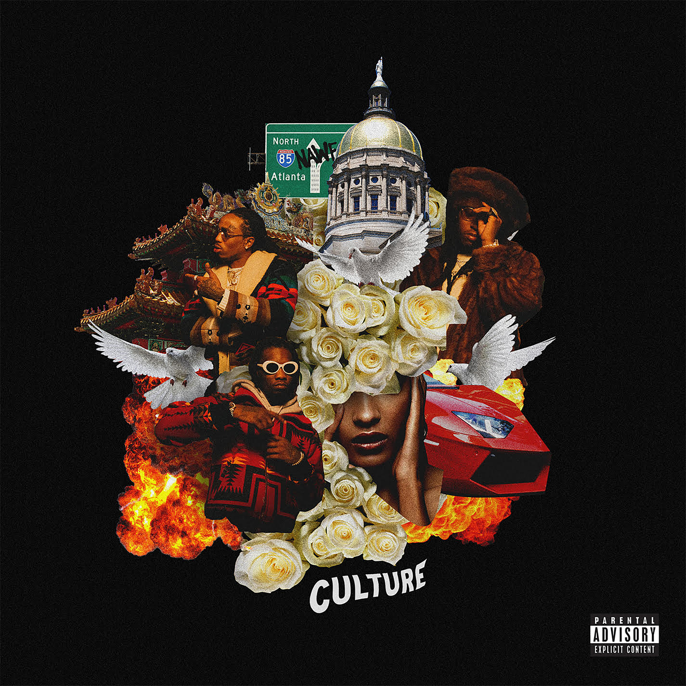
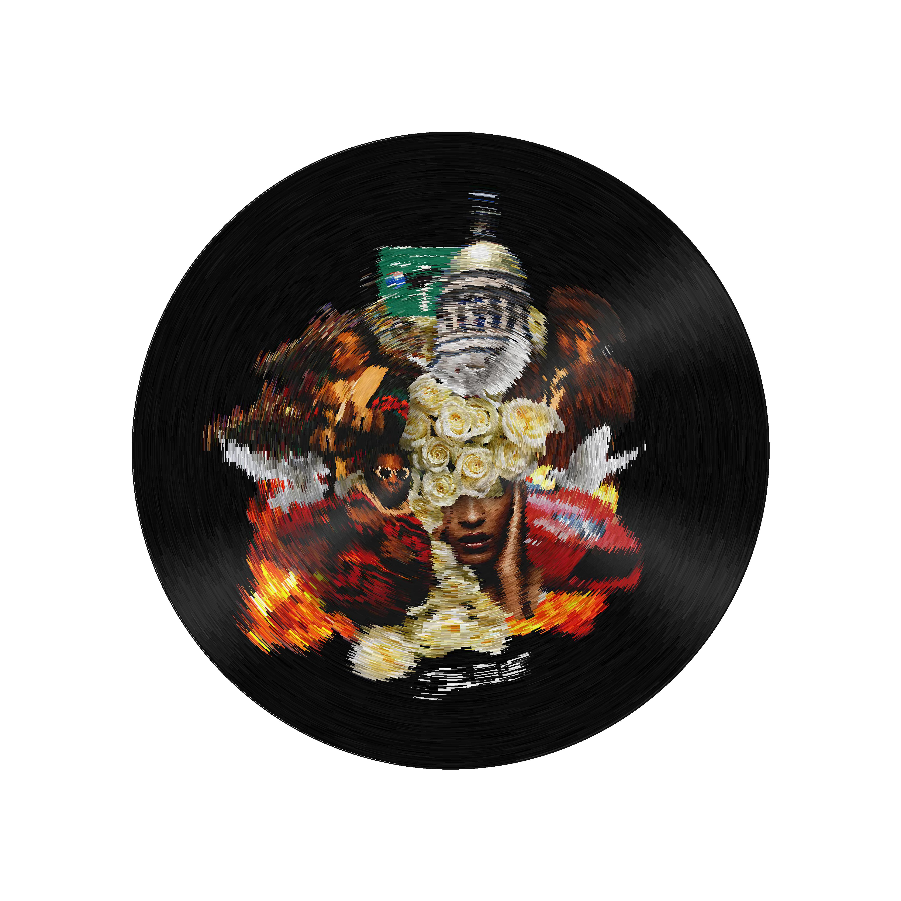

Circles in Circles
======
# cttg8217 original version #

Simple code to recreate Mac Miller's *Circles* album art with ......circles.

Use the command below to install requirements.
```pycon
pip install -r requirements.txt
```

 

# brain_stackoverflowed version (main-modified.py) #

generalized original version. can be used in any size of file.

# brain_stackoverflowed version (main-modified.py) #

Simple code to make your album cover vinyl-like and unique

 
